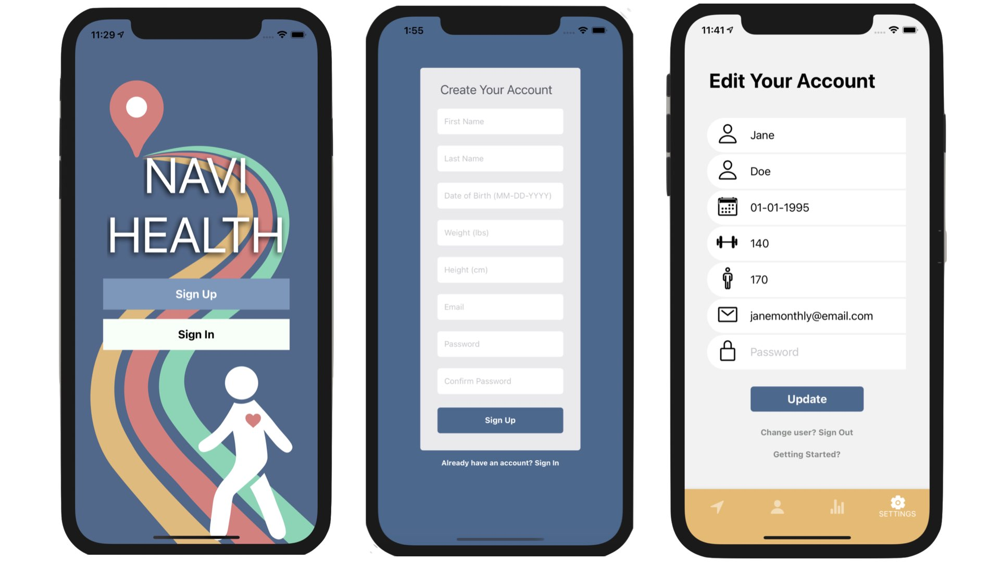
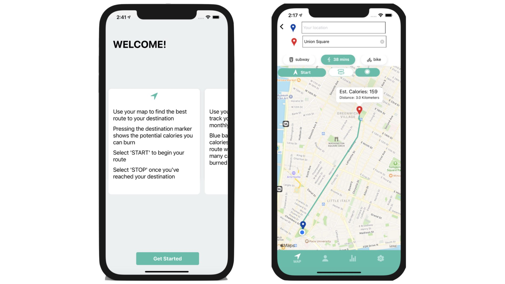
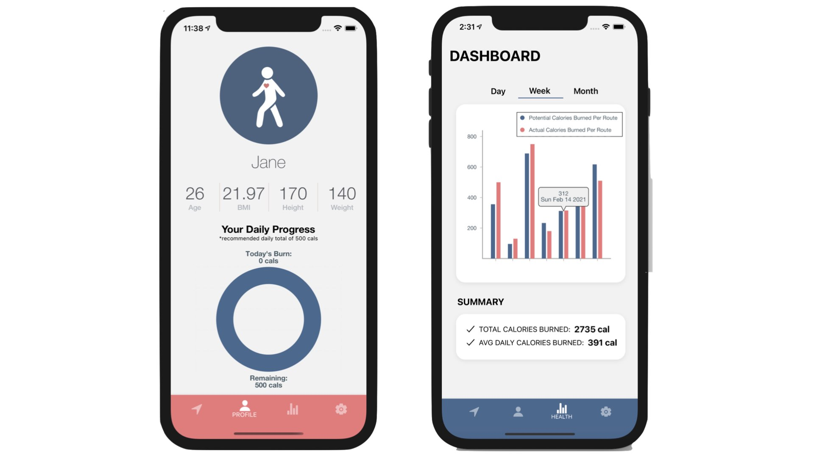

# NAVIHEALTH
NAVIHEALTH is an iOS based mobile app designed to help you track and meet your fitness goals while on the go. Along with a navigational map functionality, NAVIHEALTH stores the calories you can burn when you're trying to get from point A to point B and renders them onto beautiful charts to display daily, weekly, monthly progress.

# TECH STACK
NAVIHEALTH was written with React Native and powered by Expo-cli. NAVIHEALTH leverages Apple Maps, Google Places and Google Directions APIs to set up convenient routes for walking, biking and public transit. For data visualization NAVIHEALTH utilizes Victory to render out clean charts for users to keep track of calorie data across their routes. All data for users and user authentication, maps and routing, and user calorie management / tracking is managed through Google Firebase.

# GETTING STARTED
- git clone https://github.com/FSA-CS-Taurus/NaviHealth.git
- npm install (installs all project dependencies)
- cd ios pod install (installs CocoaPods in order to download map functionality)
- Entry point is at the root of the directory in App.js with a React Native setup
- App.js also houses the primary screen navigation for the app
- /screens holds all the individual screens for the app
- /api holds all methods and calculations for app including Firebase methods, calorie calculating functions, health stats calculations
- /assets hold all logos, pictures, static assets rendered on app

# HOW TO EXPO
- NAVIHEALTH is powered by Expo:
https://expo.io/@navihealth/projects/navihealth
- Download the [Expo client app](https://apps.apple.com/us/app/expo-client/id982107779) onto your iPhone (Android not available at this time)
- Login to the app using the following credentials:
Username: navihealth
Password: navihealthrocks
- Launch the app and explore!

# CONTRIBUTORS
[Eun Hyuk Lee](https://www.linkedin.com/in/eunhyuklee/) | [Kathryn Choi](https://www.linkedin.com/in/kathryn-choi/) | [John Ahn](https://www.linkedin.com/in/john-yo-ahn/) | [Stephen Ro](https://www.linkedin.com/in/stephen-ro)

Thank you for journeying with us!

# OUR APP

